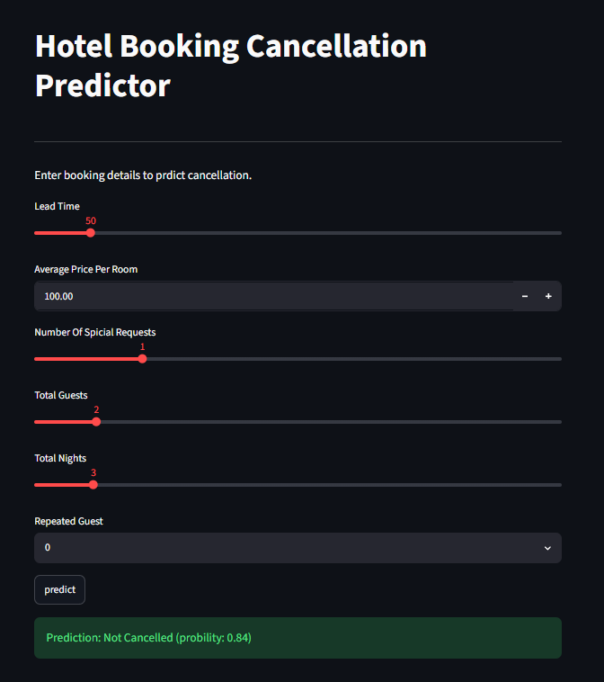

# Hotel Booking Cancellation Prediction

## Overview

This project predicts whether a hotel booking will be cancelled using Machine Learning techniques.

The project covers the complete machine learning workflow:

* Data Cleaning
* Exploratory Data Analysis (EDA)
* Feature Engineering
* Model Training
* Hyperparameter Tuning
* Model Evaluation
* Streamlit Deployment

---

## Dataset

The dataset contains hotel booking information including:

* Lead Time
* Average Price Per Room
* Number of Special Requests
* Number of Guests
* Number of Nights
* Repeated Guest Status

Target Variable:

* Booking Status (Cancelled / Not Cancelled)

---

## Technologies Used

* Python
* Pandas
* NumPy
* Matplotlib
* Seaborn
* Scikit-Learn
* XGBoost
* Streamlit
* Joblib
* Git & GitHub

---

## Project Structure

```text
Hotel-Booking-Cancellations/
│
├── app/
│   └── app.py
│
├── data/
│   ├── raw/
│   └── processed/
│
├── models/
│   └── gb_booking_model.pkl
│
├── notebooks/
│   └── notebook.ipynb
│
├── outputs/
│   ├── figures/
        ├── monthly_booking_trend.png
        └── streamlit_app.png
│   └── reports/
│
├── src/
│   ├── data_cleaning.py
│   ├── preprocessing.py
│   ├── train_model.py
│   └── utils.py
│
├── tests/
│
├── main.py
├── requirements.txt
└── README.md
```

---

## Machine Learning Workflow

1. Load Data
2. Data Cleaning
3. Feature Engineering
4. Exploratory Data Analysis
5. Train/Test Split
6. Model Training
7. Hyperparameter Tuning
8. Model Evaluation
9. Model Saving
10. Streamlit Deployment

---

## Model Performance

Final Model Accuracy:

```text
0.8224
```

---
## Exploratory Data Analysis

### Monthly Booking Trend


---

## Application Preview



### Streamlit Application


### Exploratory Data Analysis


---

## Installation

Clone repository:

```bash
git clone <repository-url>
```

Create virtual environment:

```bash
python -m venv .venv
```

Activate environment:

```bash
.venv\Scripts\activate
```

Install dependencies:

```bash
pip install -r requirements.txt
```

---

## Run Training Pipeline

```bash
python main.py
```

---

## Run Streamlit Application

```bash
streamlit run app/app.py
```

---

## Author

Mahmoud Abu Al Nour

Computer Science Student
