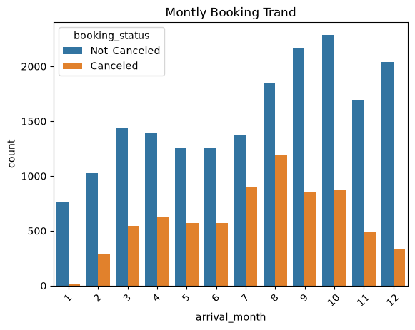
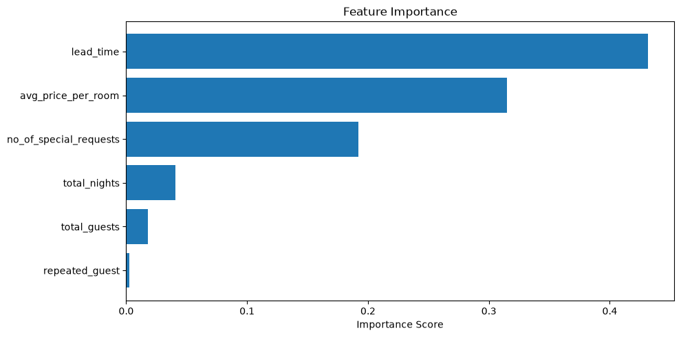
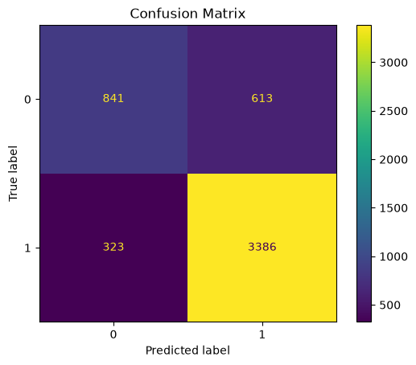

# Hotel Booking Cancellation Prediction

## Overview

This project predicts whether a hotel booking will be cancelled using Machine Learning techniques.

The project covers the complete machine learning workflow:

* Data Cleaning
* Exploratory Data Analysis (EDA)
* Feature Engineering
* Model Training
* Hyperparameter Tuning
* Model Evaluation
* Streamlit Deployment

---

## Dataset

The dataset contains hotel booking information including:

* Lead Time
* Average Price Per Room
* Number of Special Requests
* Number of Guests
* Number of Nights
* Repeated Guest Status

### Target Variable

* Booking Status (Cancelled / Not Cancelled)

---

## Technologies Used

* Python
* Pandas
* NumPy
* Matplotlib
* Scikit-Learn
* Gradient Boosting Classifier
* Streamlit
* Joblib
* Git & GitHub

---

## Project Structure

```text
Hotel-Booking-Cancellations/
│
├── app/
│   └── app.py
│
├── data/
│   ├── raw/
│   └── processed/
│
├── models/
│   └── gb_booking_model.pkl
│
├── notebooks/
│   └── notebook.ipynb
│
├── outputs/
│   ├── figures/
│   │   ├── monthly_booking_trend.png
│   │   ├── feature_importance.png
│   │   ├── confusion_matrix.png
│   │   └── streamlit_app.png
│   │
│   └── reports/
│
├── src/
│   ├── data_cleaning.py
│   ├── preprocessing.py
│   ├── train_model.py
│   └── utils.py
│
├── tests/
│
├── main.py
├── requirements.txt
└── README.md
```

---

## Machine Learning Workflow

1. Load Data
2. Data Cleaning
3. Feature Engineering
4. Exploratory Data Analysis
5. Train/Test Split
6. Model Training
7. Hyperparameter Tuning
8. Model Evaluation
9. Model Saving
10. Streamlit Deployment

---

## Evaluation Metrics

| Metric    | Score  |
| --------- | ------ |
| Accuracy  | 81.87% |
| Precision | 84.67% |
| Recall    | 91.29% |
| F1 Score  | 87.86% |

The model achieved strong classification performance, particularly in identifying booking cancellations with a Recall greater than 91%.

---

## Key Insights

* Lead Time is the most important factor affecting booking cancellations.
* Average Price Per Room has a strong influence on cancellation behavior.
* Customers with more special requests are less likely to cancel bookings.
* Total Guests and Repeated Guest status have limited predictive power.

---

## Exploratory Data Analysis

### Monthly Booking Trend



The analysis shows seasonal booking behavior, with booking activity peaking during several months of the year and cancellation patterns varying across seasons.

---

## Feature Importance



The trained Gradient Boosting model identified the following features as the most influential:

1. Lead Time
2. Average Price Per Room
3. Number of Special Requests

These features contributed most to predicting whether a booking would be cancelled.

---

## Confusion Matrix



The confusion matrix provides a detailed view of model predictions and classification performance.

---

## Application Preview

### Streamlit Web Application


The application allows users to enter booking information and receive real-time cancellation predictions using the trained machine learning model.

---

## Installation

### Clone the Repository

```bash
git clone https://github.com/Mahmoud-Abu-Al-Nour/Hotel-Booking-Cancellations.git
```

### Create Virtual Environment

```bash
python -m venv .venv
```

### Activate Virtual Environment

```bash
.venv\Scripts\activate
```

### Install Dependencies

```bash
pip install -r requirements.txt
```

---

## Run Training Pipeline

```bash
python main.py
```

---

## Run Streamlit Application

```bash
streamlit run app/app.py
```

---

## Author

Mahmoud Abu Al Nour

Computer Science Student | Data Science & Machine Learning Enthusiast
